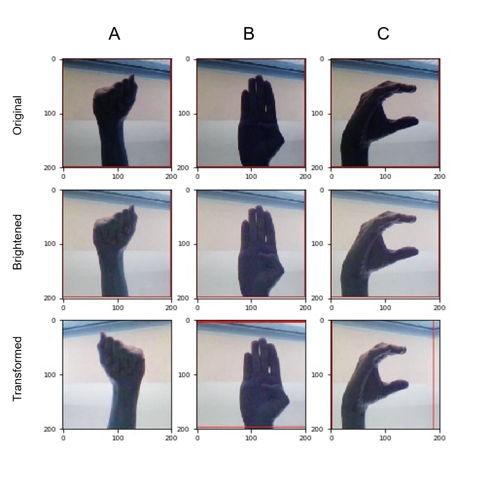
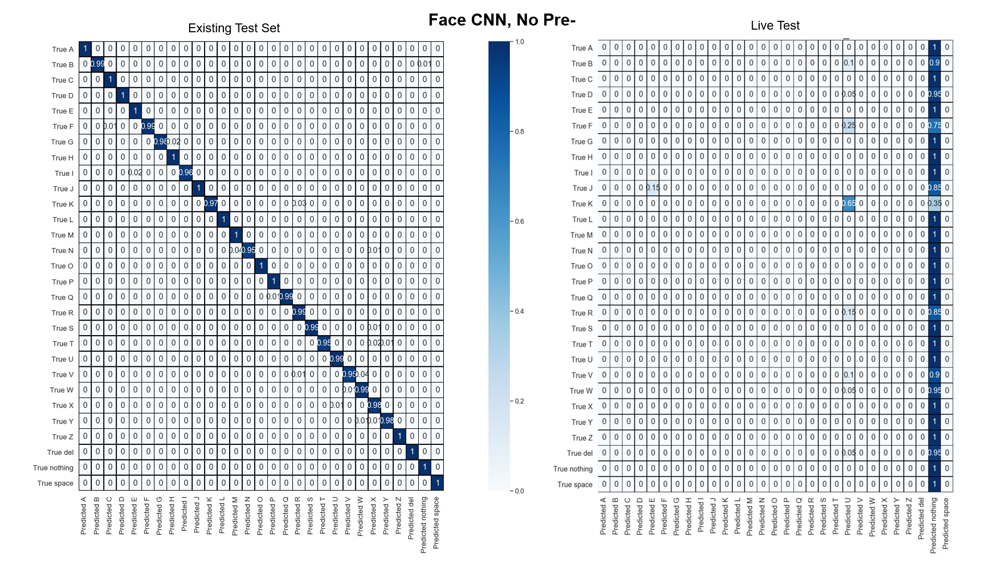
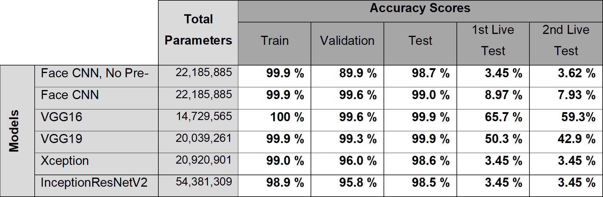

## Classifying letters of the ASL alphabet with Keras GPU

**The goals of this project were to classify letters of the American Sign Language (ASL) alphabet from existing images and new images taken from live-video.** 

Nearly five years ago, a viral video of two Deaf women ordering in sign language at a Starbucks drive thru via two-way video [made headlines](https://globalnews.ca/news/2323353/watch-woman-orders-with-sign-language-at-starbucks-drive-thru/). Since then we haven’t seen much as far as technology advancements go regarding accessibility for those who use sign language as their main means of communication. The ability to transcribe sign language for non-signers could be a way to improve accessibility for members of the Deaf, hard of hearing, and non-verbal communities. I hope the goals of this project, which include interpreting fingerspelling in real-time, can be a steppingstone towards transcribing ASL words and expressions. 

Multiple Convolutional Neural Networks (CNNs) were attempted to solve this image classification problem. CNNs initialized and trained from scratch and transfer learning (e.g., VGG16, VGG19, Xception) were trained on an [ASL dataset sourced from Kaggle](https://www.kaggle.com/grassknoted/asl-alphabet).

The dataset consisted of 29 classes with 3,000 training images for each class. The 29 classes included the 26 letters of the alphabet, as well as “nothing”, “delete” and “space” classes. All images were colour (3 channels), 200 pixels in height and width, and were in JPG format. It should be noted that the dataset included a test set of 29 images (one image for each class), which were not used. 

Instead, a new test set was created by taking 20% of the training images using the shell script `data_augmentation/split_only_asl.sh`. The shell script was responsible for: 
- Creating class-labelled sub-directories within a `test_set` directory,  
- Randomly allocating 20% of the training images for each class to their respective test sub-directories, and
- Executing the python script `data_augmentation/bright_images.py`. 

`bright_images.py` was responsible for:
- Creating brightened colour and grayscale copies of the original ASL alphabet images,
- Normalizing, resizing (64x64) and flattening each image channel to `(1, 4096)` arrays, and
- Saving those arrays to the CSV files `asl_grey.csv` or `asl_colour.csv` (for anyone interested in fitting scikit-learn machine learning classifiers).

*Figure 1. Samples of ASL letters "A", "B", and "C" in their original format, following brightening, and following augmentation with ImageDataGenerator.* 

The images were brightened to improve visibility of individual digits and their positioning. Additional preprocessing of the images, which included flipping and shifting the images horizontally, and applying a zoom and shear to the images, was randomized and completed by Keras `ImageDataGenerator`. The purpose of randomly augmenting the images was to improve model performance when introducing new images.

The first CNN architecture implemented had six weight layers and was originally created to [classify facial expressions from a live video-feed](https://towardsdatascience.com/from-raw-images-to-real-time-predictions-with-deep-learning-ddbbda1be0e4). For this project, the CNN was trained on the ASL images with (`Face CNN`) and without (`Face CNN, No Pre-`) random augmentation. Transfer learning was then leveraged by utilizing Keras `VGG16`, `VGG19`, `Xception` and `InceptionResNetV2`.

After learning from the training images, each CNN model was evaluated on their performance on the test images (first goal) and on new images acquired from a webcam in real-time (second goal). Performance on the tests were evaluated by creating confusion matrices (**Figure 2**) and classification reports from the true vs. model predicted classes. How each model performed on the image classification problem is summarized via accuracy scores in **Figure 3**.

*Figure 2. A GIF of normalized confusion matrices as heatmaps for every CNN. Left heatmap: The model's performance on the test set of images. Right heatmap: Model performance on the First Live Test.* 

*Figure 3. Each model's number of parameters and performance on the training, validation and test image sets, and new webcam-sourced images as quantified by the model accuracy scores.* 

All models achieved comparable accuracies of 98-100% when predicting the letters of the test set of existing images (first goal). However, differences in model performances became evident when introducing new images taken from a 640x480 webcam in the Live Tests.

The Live Test was completed by `model_evaluation/evaluate_live_all.py` and entailed:
- Loading the six model architectures with their best weights from training,  
- Capturing 20 frames for each class using Open Computer Vision (OpenCV),
- Having all models predict the class of each frame,
- Save the true classes and all model predicted classes to a CSV file, and
- Output the classification report and confusion matrix for each model. 

In both Live Test trials, VGG16 had the best performance, followed by VGG19. The poor performance of all other models could be attributed to differences in the number of weight layers and parameters. Xception and InceptionResNetV2 may have been [too powerful](https://towardsdatascience.com/an-intuitive-guide-to-deep-network-architectures-65fdc477db41) for the training set, quickly overfitting to the data and resulting in poor learning where weights of the earlier layers failed in updating due to [vanishing gradients](https://www.quora.com/Is-it-possible-for-a-neural-network-to-be-too-deep).

While we were able to classify ASL letters from existing images, a lot of work still needs to be done to improve ASL letter prediction in real-time. However, this project marks a first attempt towards transcribing ASL from live-video as a means of improving accessibility for those who use sign language as a primary mode of communication. 

Next steps include:
- [ ] Training a CNN on [ASL alphabet images with more variety](https://www.kaggle.com/kuzivakwashe/significant-asl-sign-language-alphabet-dataset) in terms of who is signing and in front of what background they are signing

- [ ] Incorporating a [hand-detector](https://medium.com/@victor.dibia/how-to-build-a-real-time-hand-detector-using-neural-networks-ssd-on-tensorflow-d6bac0e4b2ce)

### Resources:
**Setting up Keras GPU**
- [Set up GPU Accelerated Tensorflow & Keras on Windows 10 with Anaconda](https://medium.com/@ab9.bhatia/set-up-gpu-accelerated-tensorflow-keras-on-windows-10-with-anaconda-e71bfa9506d1)
- [Installing a Python Based Machine Learning Environment in Windows 10](https://towardsdatascience.com/installing-keras-tensorflow-using-anaconda-for-machine-learning-44ab28ff39cb)

**Transfer Learning and Image Preprocessing**
- [How to Configure Image Data Augmentation in Keras](https://machinelearningmastery.com/how-to-configure-image-data-augmentation-when-training-deep-learning-neural-networks/)
- [Transfer Learning using Keras](https://medium.com/@14prakash/transfer-learning-using-keras-d804b2e04ef8)
- [The 4 Convolutional Neural Network Models That Can Classify Your Fashion Images](https://towardsdatascience.com/the-4-convolutional-neural-network-models-that-can-classify-your-fashion-images-9fe7f3e5399d)

**Configuring OpenCV for Real-Time Predictions**
- [From raw images to real-time predictions with Deep Learning](https://towardsdatascience.com/from-raw-images-to-real-time-predictions-with-deep-learning-ddbbda1be0e4)
- [Training a Neural Network to Detect Gestures with OpenCV in Python](https://towardsdatascience.com/training-a-neural-network-to-detect-gestures-with-opencv-in-python-e09b0a12bdf1)
- [Capture webcam with Python (OpenCV): step by step](https://www.youtube.com/watch?v=1XTqE7LFQjI)

## Navigating this git repo 

### No directories:

- `README.md` 

- `evaluate_live_all.py` prompts user as acquiring 20 webcam images for each class, feeds the image into all models listed above to get predictions, acquries accuracy_score, classification_report, confusion_matrix for each CNN model

- `capstone_demo.py` acquires webcam images and provides **VGG16** predictions for demonstrative and interactive purposes (used to make the opening GIF)

### Within the directories:

**data_augmentation** 

- `split_only_asl.sh` creates test sets and the sub-directories, executes `bright_images.py`

- `bright_images.py` creates brightened colour and grayscale copies of the training and test sets, and CSV files for scikit-learn models

 
**CNN_rawlive**

- `CNN_full_200.py`	training (W/ NO IMAGE AUGMENTATION) and evaluating a CNN originally created for facial expression classification 

- `CNN_allasl_200_notransform_output.html` the outputs from running `CNN_full_200.py` in Spyder

**CNN_rawlive_transform**

- `CNN_all200_transform.py`	training and evaluating same CNN as above W/ AUGMENTATION

- `CNN_all200_transform_outputs.html` outputs from `CNN_all200_transform.py` in Spyder

**VGG16**

- `vgg16_full200.py` training and evaluating a VGG16

- `vgg16_full200_output.html` outputs from `vgg16_full200.py` in Spyder

**VGG19**

- `vgg19_full200.py` training and evaluating a VGG19

- `VGG19_output.html` outputs from `vgg19_full200.py` in Spyder

**xception**

- `xception_full.py` training and evaluating an Xception model

- `xception_outputs.html` outputs from `xception_full.py` in Spyder

**Inception_capstone**

- `inception_capstone.py` training and evaluating an InceptionResNetV2 model

- `inception_capstone_outputs.html`	outputs from `inception_capstone.py` in Spyder

**demo**

- `demo.gif` demonstration of `capstone_demo.py`

- `figure_1.png` *Figure 1. Samples of ASL letters "A", "B", and "C" in their original format, following brightening, and following augmentation with ImageDataGenerator.* 

- `figure_2.gif` *Figure 2. A GIF of normalized confusion matrices as heatmaps for every CNN. Left heatmap: The model's performance on the test set of images. Right heatmap: Model performance on the First Live Test.* 

- `figure_3.png` *Figure 3. Each model's number of parameters and performance on the training, validation and test image sets, and new webcam-sourced images as quantified by the model accuracy scores.* 